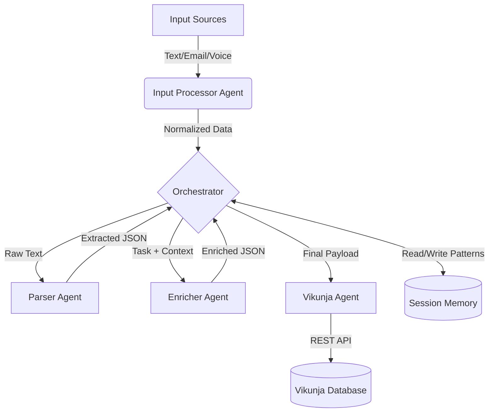

# TaskFlow AI - Multi-Channel Agentic Task Orchestrator


TaskFlow AI is a multi-agent system designed to solve "Input Fragmentation." It acts as an intelligent executive assistant that aggregates tasks from Voice, Email, and Text, enriches them with context using Google's Gemini 2.5 Flash, and organizes them into Vikunja with intuitive color-coding.


## Introduction

In our modern digital lives, tasks don't come from a single source. They arrive as fragmented data points: a quick voice note while driving, a forwarded email from a client, or a hasty text message sent to oneself. The cognitive load of aggregating these inputs into a structured to-do list is often heavier than the tasks themselves.

TaskFlow AI solves this by deploying an agentic mesh that listens, understands, enriches, and organizes tasks automatically, preserving context and reducing friction.


## Problem & Solution

### The Problem
Task management across multiple channels is fragmented and inefficient. Users struggle with:
* **Context Switching:** Manually copying data from emails or transcripts to to-do lists.
* **Loss of Detail:** Forgetting the "why" or "when" behind a quick note.
* **Organization Chaos:** All tasks look the same, regardless of urgency or source.

### The Solution: Agentic Architecture
We utilize a system of specialized agents because a monolithic script cannot handle the complexity of:
1.  **Input Normalization:** Handling raw audio, SMTP payloads, and CLI text.
2.  **Natural Language Understanding:** Using LLMs to extract intent.
3.  **Contextual Enrichment:** Learning patterns from session history.


## Architecture: 5 Specialized Agents

The system relies on 5 Specialized Agents coordinating via a central Orchestrator.

```
INPUT SOURCES (text, email, voice)
    ↓
INPUT PROCESSOR AGENT
(Detects type, normalizes format)
    ↓
PARSER AGENT (with Gemini 2.5 Flash)
(Extracts: title, description, priority, due_date, labels)
    ↓
ENRICHER AGENT (with context from SessionMemory)
(Enhances: priority, labels, due_date based on patterns)
    ↓
VIKUNJA AGENT
(Creates task with color based on input source)
    ↓
VIKUNJA DATABASE
(Task stored with metadata and color)
    ↓
SESSION MEMORY
(Learns patterns for future enrichment)
```


### Core Components
1. **Input Processor** - Handles text, email, and voice inputs
2. **Parser Agent** - Extracts structured task data using Gemini LLM
3. **Enricher Agent** - Enhances tasks with context and patterns
4. **Vikunja Agent** - Creates tasks in Vikunja with color-coding
5. **Orchestrator** - Coordinates multi-agent workflow

### Tools
- **Gemini LLM Service** - Task extraction and enrichment
- **Vikunja API Client** - Task management integration
- **Email Tools** - Email parsing
- **Voice Tools** - Audio transcription (mock mode)

### Core Stack
- **Language:** Python 3.11+
- **Framework:** Async/await (asyncio)
- **LLM:** Google Gemini 2.5 Flash API
- **Task Manager:** Vikunja (self-hosted via Docker)
- **Storage:** SessionMemory (in-memory) + Vikunja DB

### How it works


### Color Scheme
- 🔵 **Dark Blue** (#03346E) - Voice input
- 🟣 **Plum** (#8C3061) - Email input
- 🟦 **Dark Teal** (#1A3636) - Text input


## Features
- [x] Multi-channel input (text, email, voice)
- [x] Intelligent task extraction with Gemini 2.5 Flash
- [x] Context-based task enrichment
- [x] Color-coded tasks by input source
- [x] Session memory with pattern learning
- [x] Structured JSON logging
- [x] OpenTelemetry tracing support
- [x] Error handling & graceful degradation


## Why Agents?

Agents are the ideal solution because:

1. **Specialization** - Each agent handles one responsibility
   - InputProcessor: Multi-channel input normalization
   - ParserAgent: Natural language task extraction
   - EnricherAgent: Context-based task enhancement
   - VikunjaBAgent: Task creation with color-coding
   - Orchestrator: Coordinates the workflow

2. **Modularity** - Easy to add/replace components
   - Swap LLM provider (Gemini → Claude, etc.)
   - Add new input channels (SMS, Slack, etc.)
   - Replace Vikunja with different task manager

3. **Observability** - Clear logging at each step
   - Track input through pipeline
   - Debug failures at specific agent
   - Monitor performance per component

4. **Scalability** - Handles complexity through composition
   - 3 inputs handled by 1 processor
   - 5 agents coordinate automatically
   - 4 tools integrated seamlessly


## Why this matters 

TaskFlow AI moves beyond simple "trigger-action" automation (like IFTTT) by deploying a context-aware agentic mesh that actively reasons about your data.

1. True Multi-Channel Unification: Seamlessly aggregates three distinct communication protocols—SMTP (Email), Audio Streams (Voice), and CLI/Chat (Text)—into a single normalised pipeline. 

2. Source-Aware Visualization: Automatically injects visual cues into Vikunja (Color-coding: Blue=Voice, Plum=Email) so users can instantly identify the origin of a task at a glance.

3. Intelligent Agentic Orchestration: Contextual Enrichment: Unlike standard parsers, the Enricher Agent uses Session Memory to understand vague requests (e.g., "Add a subtask to that project we discussed" links to the previous context automatically). 

4. Gemini 2.5 Flash Powered: Leverages the sub-second latency of Google's latest model to parse complex natural language into strict JSON structures with near-zero waiting time.

5. Graceful Degradation: The Orchestrator ensures reliability; if the Enrichment Agent fails, the Parser Agent still delivers the core task, ensuring no user input is ever lost.


| Feature | Old Way (Zapier/Scripts) | TaskFlow AI Way |
| :--- | :--- | :--- |
| **Logic** | Simple `If This Then That` rules | **LLM-based Reasoning** (Intent extraction) |
| **Context** | Stateless (Each run is new) | **Session Memory** (Remembers previous turns) |
| **Speed** | Polling intervals (1-15 mins) | **Event-Driven Real-time** processing |
| **Visibility** | "It failed." | **OpenTelemetry** Trace ID `a1b2...` shows exactly where. |


## Demo:

### Project Structure
```
taskflow-ai
├─ agents
│  ├─ enricher_agent.py
│  ├─ input_processor.py
│  ├─ orchestrator.py
│  ├─ parser_agent.py
│  ├─ vikunja_agent.py
│  └─ __init__.py
├─ config.py
├─ demo.py
├─ docker-compose.yml
├─ images
│  ├─ taskflow_vikunja_screenshot_1.png
│  └─ taskflow_vikunja_screenshot_2.png
├─ LICENSE
├─ main.py
├─ README.md
├─ requirements.txt
├─ tools
│  ├─ email_tools.py
│  ├─ gemini_tools.py
│  ├─ vikunja_api.py
│  ├─ voice_tools.py
│  └─ __init__.py
└─ utils
   ├─ logger.py
   ├─ memory.py
   ├─ tracing.py
   └─ __init__.py
```

### Prerequisites
- Docker & Docker Compose
- Python 3.11+
- Gemini API key: https://makersuite.google.com/app/apikey

### Step 1: Bring Up the System
```bash
# Start Vikunja
docker-compose up -d

# Setup account in Vikunja dashboard by logging into 'http://localhost:3456/'

# Update the API Key and other details in the .env file
cp .env.example .env # Now edit .env file with your details

# Install dependencies
pip install -r requirements.txt

# Run demo
python main.py
```

### Step 2: Processing Pipeline
```
Input 1: "Fix the login bug by Friday - it's critical"
  → Detected as: TEXT
  → Extracted: title="Fix the login bug", priority=2
  → Created: Dark Teal task (#1A3636)

Input 2: "From: manager@company.com\nSubject: Review Q1 Marketing..."
  → Detected as: EMAIL
  → Extracted: title="Review Q1 Marketing Presentation"
  → Created: Plum task (#8C3061)

Input 3: "Schedule team sync about new API design"
  → Detected as: TEXT
  → Extracted: title="Schedule team sync"
  → Created: Dark Teal task (#1A3636)
```

### Step 3: Results in Vikunja
Open Vikunja dashboard

Expected output:
- 3 sample tasks created
- Color-coded in Vikunja dashboard
- Logs showing extraction and enrichment

